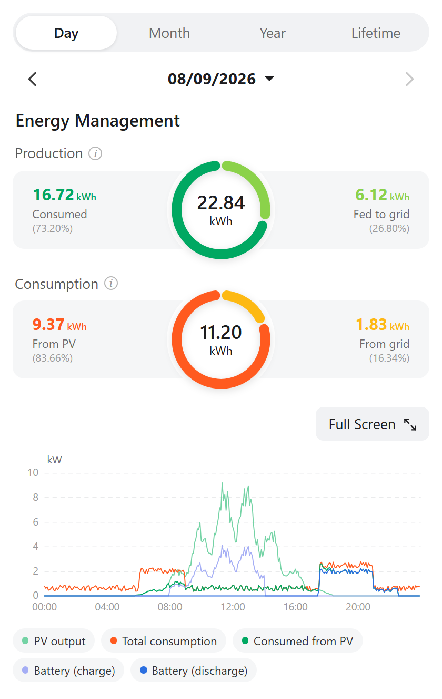
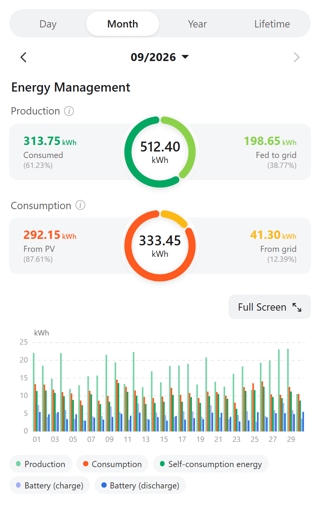
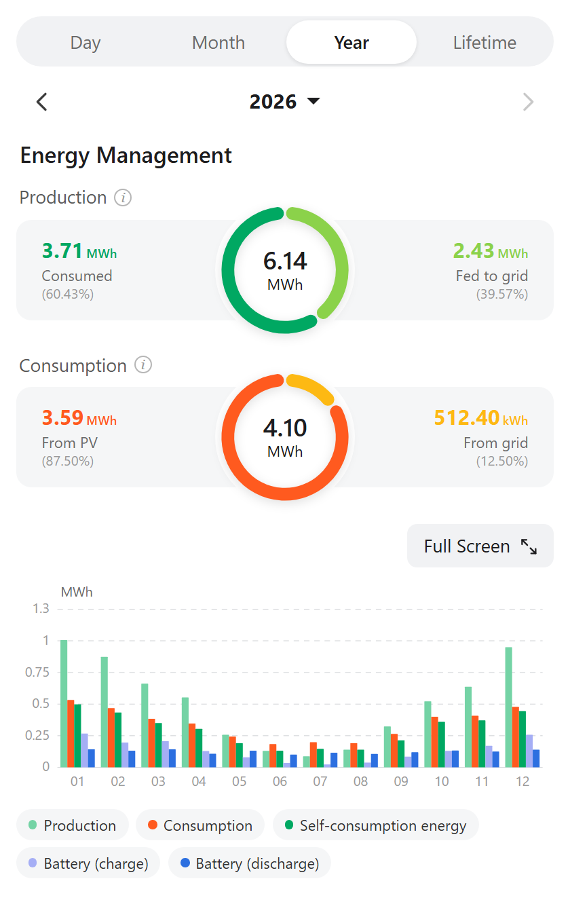
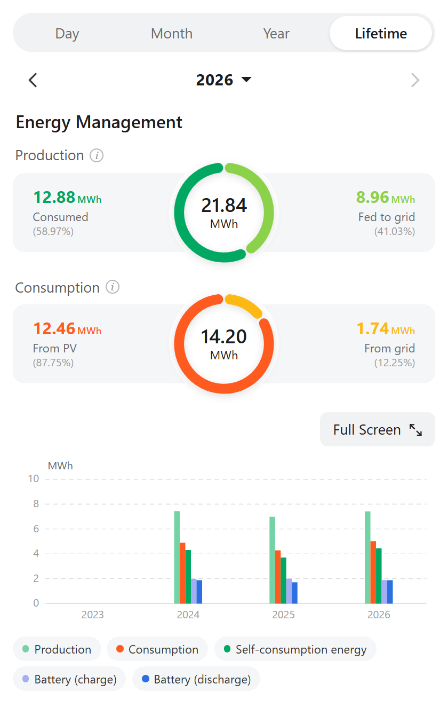

# FusionSolar Statistics Card

[](https://hacs.xyz/)
[](https://github.com/mayerwin/ha-fusionsolar-statistics/actions/workflows/validate.yml)
[](https://github.com/mayerwin/ha-fusionsolar-statistics/releases)
[](LICENSE)

A Home Assistant Lovelace card that reproduces the **Huawei FusionSolar app's "Statistics"
screen** — the Day / Month / Year / Lifetime tabs, the twin production & consumption donuts,
and the per-period energy chart — built entirely from **Home Assistant's own long-term
statistics**.

No FusionSolar account, no cloud API, no Northbound credentials. If your inverter data is
already in Home Assistant (for example via
[`wlcrs/huawei_solar`](https://github.com/wlcrs/huawei_solar) over local Modbus), this card
draws the app's screen from it.

| Day | Month |
|---|---|
|  |  |

| Year | Lifetime |
|---|---|
|  |  |

<sub>Screenshots use synthetic data generated by <code>tools/demo.html</code>.</sub>

## Why

The FusionSolar app presents solar data in a way that is genuinely awkward to rebuild with
stock Lovelace cards: two split donuts that break production into *consumed vs exported* and
consumption into *from PV vs from grid*, plus a chart that changes shape per period. This
card does exactly that, and nothing else.

- **No build step, no dependencies.** One vanilla custom element with inline SVG.
- **Reads the recorder, not the inverter.** Zero extra Modbus load — which matters, because
  Huawei inverters accept only one Modbus TCP connection at a time.
- **Responsive.** Sizes derive from the card's own width via CSS container queries, so it
  keeps the app's proportions on a phone and stays legible on a wide desktop card.

## Installation

### HACS

1. Open **HACS → ⋮ → Custom repositories**.
2. Add `https://github.com/mayerwin/ha-fusionsolar-statistics` with category **Dashboard**.
3. Search for **FusionSolar Statistics Card** and download it.
4. Reload your browser — HACS registers the dashboard resource for you.

[](https://my.home-assistant.io/redirect/hacs_repository/?owner=mayerwin&repository=ha-fusionsolar-statistics&category=dashboard)

### Manual

1. Copy `dist/fusionsolar-statistics-card.js` to `<config>/www/`.
2. Add it under **Settings → Dashboards → ⋮ → Resources** as
   `/local/fusionsolar-statistics-card.js`, type **JavaScript Module**.
3. Reload your browser.

## Configuration

```yaml
type: custom:fusionsolar-statistics-card
title: Energy Management
default_period: day          # day | month | year | lifetime
show_full_screen: true
entities:
  # --- required: cumulative energy sensors (kWh) ---
  production: sensor.inverter_total_yield
  fed_to_grid: sensor.emma_total_feed_in_to_grid
  from_grid: sensor.emma_total_supply_from_grid
  # --- optional but strongly recommended: battery energy ---
  battery_charge: sensor.emma_total_charged_energy
  battery_discharge: sensor.emma_total_discharged_energy
  # --- optional: power sensors, used only by the Day chart (W) ---
  pv_power: sensor.emma_pv_output_power
  load_power: sensor.emma_load_power
  grid_power: sensor.emma_active_power                        # positive = importing
  battery_power: sensor.emma_battery_charge_discharge_power   # positive = charging
```

### Options

| Option | Type | Default | Description |
|---|---|---|---|
| `title` | string | `Energy Management` | Heading above the donuts |
| `default_period` | string | `day` | Tab selected on load |
| `show_full_screen` | bool | `true` | Show the Full Screen button |
| `entities` | map | — | See below |

### Entities

| Key | Required | Unit | Meaning |
|---|---|---|---|
| `production` | ✅ | kWh | Cumulative generation — see the note below |
| `fed_to_grid` | ✅ | kWh | Cumulative export |
| `from_grid` | ✅ | kWh | Cumulative import |
| `battery_charge` | — | kWh | Cumulative energy into the battery |
| `battery_discharge` | — | kWh | Cumulative energy out of the battery |
| `pv_power` | — | W | Day chart: PV output |
| `load_power` | — | W | Day chart: house load |
| `grid_power` | — | W | Day chart: grid, **positive = import** |
| `battery_power` | — | W | Day chart: battery, **positive = charging** |

All energy entities must be **cumulative counters** that Home Assistant records as `sum`
statistics. The card reads per-bucket deltas via `recorder/statistics_during_period` with
`types: ["change"]`, so it never double-counts and needs no helper or template sensors.

> `pv_production` is accepted as a deprecated alias for `production`.

## How the numbers are derived

The app shows two rings that do **not** measure the same thing, which is the subtle part:

```
Production ring   total = production
                  Consumed    = production - fed_to_grid
                  Fed to grid = fed_to_grid

Consumption ring  total = From PV + From grid
                  From grid = from_grid
                  From PV   = (production - fed_to_grid) - battery_charge + battery_discharge
```

"Consumed" (production side) includes generation that went into the **battery**; "From PV"
(consumption side) is what the *house* actually drew from solar, so it subtracts battery
charging and adds battery discharging. That is why the two rings legitimately disagree.

### ⚠ Which sensor to use for `production`

This matters a lot. On a Huawei **EMMA** system, use the **inverter's AC yield**, not the
EMMA PV (DC) yield. Deviation from the app's own Lifetime figures, measured on an EMMA-based
system:

| Field | PV (DC) yield | Inverter AC yield |
|---|---|---|
| production | +8.6% | **+0.4%** |
| consumed | +16.8% | **−1.8%** |
| from PV | +19.9% | **+0.8%** |
| consumption | +18.4% | **+0.9%** |

A unit-free cross-check agrees: the consumed share came out at 47.0% using PV yield and 42.7%
using inverter yield, against the app's 43.7%.

**Validate with cumulative lifetime registers, never same-day counters.** A system reset
clears the daily registers on the Modbus side while the cloud keeps the whole day, so a
same-day comparison can look wildly wrong for reasons unrelated to the model. Expect ~1–2%
residual drift between Modbus and FusionSolar's cloud regardless — they do not account
identically.

## Data resolution

| Tab | Ring window | Chart |
|---|---|---|
| Day | the selected day | 5-minute power means (falls back to hourly beyond the short-term retention window) |
| Month | the selected month | daily energy bars |
| Year | the selected year | monthly energy bars |
| Lifetime | everything to date | yearly energy bars |

The card only shows what Home Assistant has recorded. It does **not** back-fill history from
the FusionSolar cloud — if HA started recording last week, the Lifetime tab starts last week.
See `recorder.import_statistics` if you want to import history from elsewhere.

## Compatibility

Built against Home Assistant **2024.1+**, and developed against a Huawei EMMA-based
installation read over local Modbus by `wlcrs/huawei_solar`.

The card itself is hardware-agnostic: it only ever reads statistics from Home Assistant's
recorder, so any system that produces the cumulative kWh sensors listed above will work —
including non-Huawei ones.

## Development

No build step. See [CONTRIBUTING.md](CONTRIBUTING.md) — `tools/demo.html` renders the card
against synthetic data with no Home Assistant needed.

## Licence

[MIT](LICENSE) · Not affiliated with, endorsed by, or supported by Huawei. "FusionSolar" is a
trademark of Huawei Technologies Co., Ltd.
